# ARCHITECTURE: Cars24 Jockey Copilot

## Decision Map

| Area | Locked Choice | Why It Exists |
|---|---|---|
| App | Expo React Native development build | Native Android demo, fast iteration, production-like permissions |
| Camera | React Native VisionCamera | Live preview, programmatic `takePhoto()`, future frame processors |
| Backend | FastAPI Python on AWS Lambda using Mangum | Python AI workflow, simple AWS deployment |
| Media | S3 presigned uploads | Device uploads evidence and backend stores generated report artifacts |
| State | Local SQLite file for hack, swappable later | Durable-enough local inspection state without SaaS dependency |
| AI | OpenAI behind FastAPI | Device never holds AI keys; backend controls prompts and schemas |
| Vehicle data | Mock registration lookup for hack | Same interface can later connect to Cars24/RC provider |
| Video strategy | Sampled frames, not raw video stream | Feasible, lower latency/cost, supported by current OpenAI vision flow |

## System Architecture

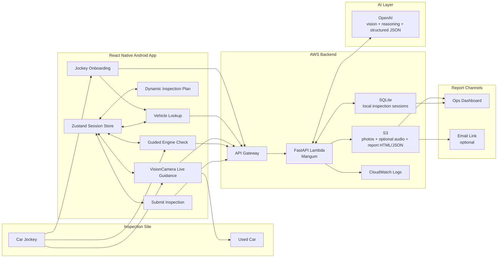
```mermaid
flowchart LR
  subgraph User["Inspection Site"]
    J["Car Jockey"]
    C["Used Car"]
  end

  subgraph App["React Native Android App"]
    Onboarding["Jockey Onboarding"]
    Lookup["Vehicle Lookup"]
    Plan["Dynamic Inspection Plan"]
    Camera["VisionCamera Live Guidance"]
    Engine["Guided Engine Check"]
    Submit["Submit Inspection"]
    Store["Zustand Session Store"]
  end

  subgraph AWS["AWS Backend"]
    API["API Gateway"]
    Lambda["FastAPI Lambda<br/>Mangum"]
    DDB["SQLite<br/>local inspection sessions"]
    S3["S3<br/>photos + optional audio + report HTML/JSON"]
    Logs["CloudWatch Logs"]
  end

  subgraph AI["AI Layer"]
    OpenAI["OpenAI<br/>vision + reasoning + structured JSON"]
  end

  subgraph Reports["Report Channels"]
    Dashboard["Ops Dashboard"]
    Email["Email Link<br/>optional"]
  end

  J --> Onboarding
  Onboarding --> Lookup
  J --> Camera
  J --> Engine
  Camera --> C
  Onboarding --> API
  Lookup --> API
  Camera --> API
  Engine --> API
  Submit --> API
  API --> Lambda
  Lambda <--> DDB
  Lambda --> S3
  Lambda <--> OpenAI
  Lambda --> Logs
  S3 --> Dashboard
  S3 --> Email
  DDB --> Dashboard
  Store <--> Lookup
  Store <--> Plan
  Store <--> Camera
  Store <--> Engine
  Store <--> Submit
```

## App Surface Map

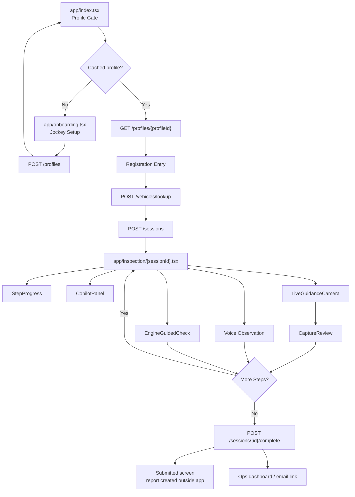
```mermaid
flowchart TD
  Start["app/index.tsx<br/>Profile Gate"] --> ProfileCache{"Cached profile?"}
  ProfileCache -->|No| Onboarding["app/onboarding.tsx<br/>Jockey Setup"]
  ProfileCache -->|Yes| GetProfile["GET /profiles/{profileId}"]
  Onboarding --> CreateProfile["POST /profiles"]
  CreateProfile --> Start
  GetProfile --> Lookup["Registration Entry"]
  Lookup --> LookupAPI["POST /vehicles/lookup"]
  LookupAPI --> SessionAPI["POST /sessions"]
  SessionAPI --> Inspect["app/inspection/[sessionId].tsx"]

  Inspect --> Stepper["StepProgress"]
  Inspect --> Copilot["CopilotPanel"]
  Inspect --> Capture["LiveGuidanceCamera"]
  Inspect --> Voice["Voice Observation"]
  Inspect --> Engine["EngineGuidedCheck"]

  Capture --> Review["CaptureReview"]
  Review --> NextStep{"More Steps?"}
  Voice --> NextStep
  Engine --> NextStep
  NextStep -->|Yes| Inspect
  NextStep -->|No| CompleteAPI["POST /sessions/{id}/complete"]
  CompleteAPI --> Submitted["Submitted screen<br/>report created outside app"]
  CompleteAPI --> Dashboard["Ops dashboard / email link"]
```

## Client Module Map

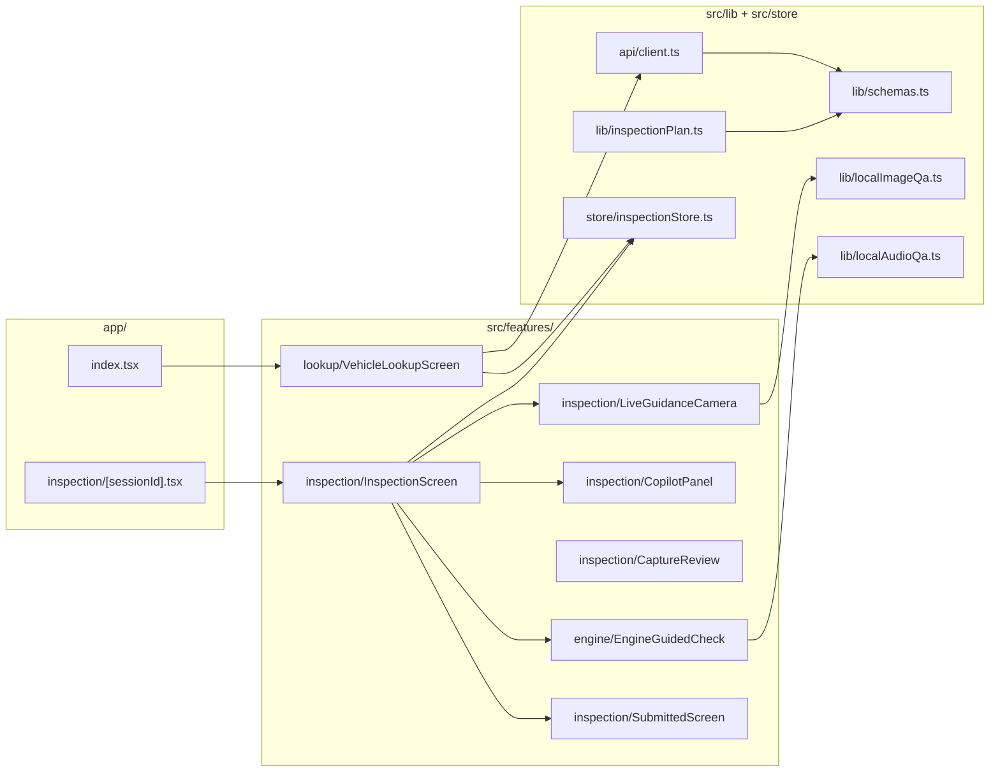
```mermaid
flowchart LR
  subgraph AppRoutes["app/"]
    Index["index.tsx"]
    InspectionRoute["inspection/[sessionId].tsx"]
  end

  subgraph Features["src/features/"]
    LookupScreen["lookup/VehicleLookupScreen"]
    InspectionScreen["inspection/InspectionScreen"]
    LiveCamera["inspection/LiveGuidanceCamera"]
    CopilotPanel["inspection/CopilotPanel"]
    CaptureReview["inspection/CaptureReview"]
    EngineCheck["engine/EngineGuidedCheck"]
    SubmittedScreen["inspection/SubmittedScreen"]
  end

  subgraph Core["src/lib + src/store"]
    ApiClient["api/client.ts"]
    Schemas["lib/schemas.ts"]
    PlanBuilder["lib/inspectionPlan.ts"]
    LocalImageQA["lib/localImageQa.ts"]
    LocalAudioQA["lib/localAudioQa.ts"]
    Store["store/inspectionStore.ts"]
  end

  Index --> LookupScreen
  InspectionRoute --> InspectionScreen
  LookupScreen --> ApiClient
  InspectionScreen --> LiveCamera
  InspectionScreen --> CopilotPanel
  InspectionScreen --> EngineCheck
  InspectionScreen --> SubmittedScreen
  LiveCamera --> LocalImageQA
  EngineCheck --> LocalAudioQA
  LookupScreen --> Store
  InspectionScreen --> Store
  ApiClient --> Schemas
  PlanBuilder --> Schemas
```

## Backend Module Map

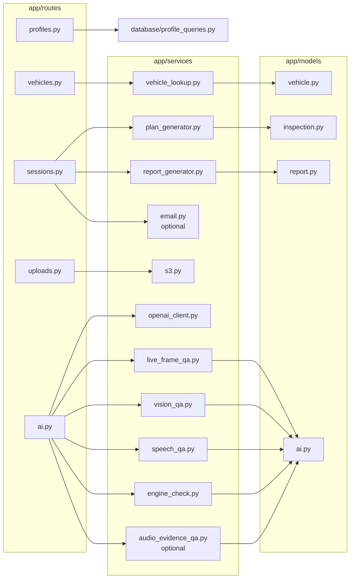
```mermaid
flowchart LR
  subgraph Routes["app/routes"]
    Profiles["profiles.py"]
    Vehicles["vehicles.py"]
    Sessions["sessions.py"]
    Uploads["uploads.py"]
    AI["ai.py"]
  end

  subgraph Services["app/services"]
    VehicleLookup["vehicle_lookup.py"]
    PlanGen["plan_generator.py"]
    S3Svc["s3.py"]
    OpenAIClient["openai_client.py"]
    LiveFrameQA["live_frame_qa.py"]
    VisionQA["vision_qa.py"]
    SpeechQA["speech_qa.py"]
    EngineCheck["engine_check.py"]
    AudioEvidenceQA["audio_evidence_qa.py<br/>optional"]
    ReportGen["report_generator.py"]
    EmailSvc["email.py<br/>optional"]
  end

  subgraph Models["app/models"]
    VehicleModel["vehicle.py"]
    InspectionModel["inspection.py"]
    AIModel["ai.py"]
    ReportModel["report.py"]
  end

  ProfileStore["database/profile_queries.py"]

  Profiles --> ProfileStore
  Vehicles --> VehicleLookup
  Sessions --> PlanGen
  Uploads --> S3Svc
  AI --> OpenAIClient
  AI --> LiveFrameQA
  AI --> VisionQA
  AI --> SpeechQA
  AI --> EngineCheck
  AI --> AudioEvidenceQA
  Sessions --> ReportGen
  Sessions --> EmailSvc

  VehicleLookup --> VehicleModel
  PlanGen --> InspectionModel
  LiveFrameQA --> AIModel
  VisionQA --> AIModel
  SpeechQA --> AIModel
  EngineCheck --> AIModel
  AudioEvidenceQA --> AIModel
  ReportGen --> ReportModel
```

## End-To-End Inspection Sequence

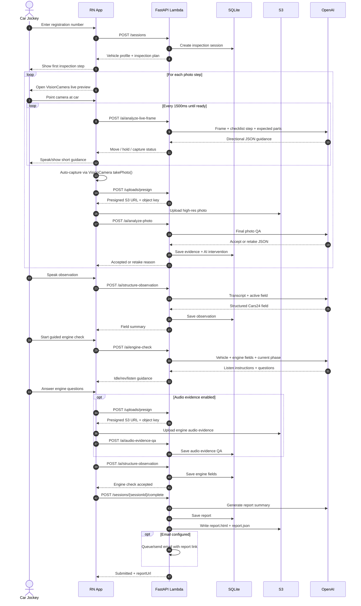
```mermaid
sequenceDiagram
  autonumber
  actor J as Car Jockey
  participant App as RN App
  participant API as FastAPI Lambda
  participant DDB as SQLite
  participant S3 as S3
  participant OAI as OpenAI

  J->>App: Enter registration number
  App->>API: POST /sessions
  API->>DDB: Create inspection session
  API-->>App: Vehicle profile + inspection plan
  App-->>J: Show first inspection step

  loop For each photo step
    App-->>J: Open VisionCamera live preview
    J->>App: Point camera at car
    loop Every 1500ms until ready
      App->>API: POST /ai/analyze-live-frame
      API->>OAI: Frame + checklist step + expected parts
      OAI-->>API: Directional JSON guidance
      API-->>App: Move / hold / capture status
      App-->>J: Speak/show short guidance
    end
    App->>App: Auto-capture via VisionCamera takePhoto()
    App->>API: POST /uploads/presign
    API-->>App: Presigned S3 URL + object key
    App->>S3: Upload high-res photo
    App->>API: POST /ai/analyze-photo
    API->>OAI: Final photo QA
    OAI-->>API: Accept or retake JSON
    API->>DDB: Save evidence + AI intervention
    API-->>App: Accepted or retake reason
  end

  J->>App: Speak observation
  App->>API: POST /ai/structure-observation
  API->>OAI: Transcript + active field
  OAI-->>API: Structured Cars24 field
  API->>DDB: Save observation
  API-->>App: Field summary

  J->>App: Start guided engine check
  App->>API: POST /ai/engine-check
  API->>OAI: Vehicle + engine fields + current phase
  OAI-->>API: Listen instructions + questions
  API-->>App: Idle/rev/listen guidance
  J->>App: Answer engine questions
  opt Audio evidence enabled
    App->>API: POST /uploads/presign
    API-->>App: Presigned S3 URL + object key
    App->>S3: Upload engine audio evidence
    App->>API: POST /ai/audio-evidence-qa
    API->>DDB: Save audio evidence QA
  end
  App->>API: POST /ai/structure-observation
  API->>DDB: Save engine fields
  API-->>App: Engine check accepted

  App->>API: POST /sessions/{sessionId}/complete
  API->>OAI: Generate report summary
  API->>DDB: Save report
  API->>S3: Write report.html + report.json
  opt Email configured
    API->>API: Queue/send email with report link
  end
  API-->>App: Submitted + reportUrl
```

## Live Guidance Sequence

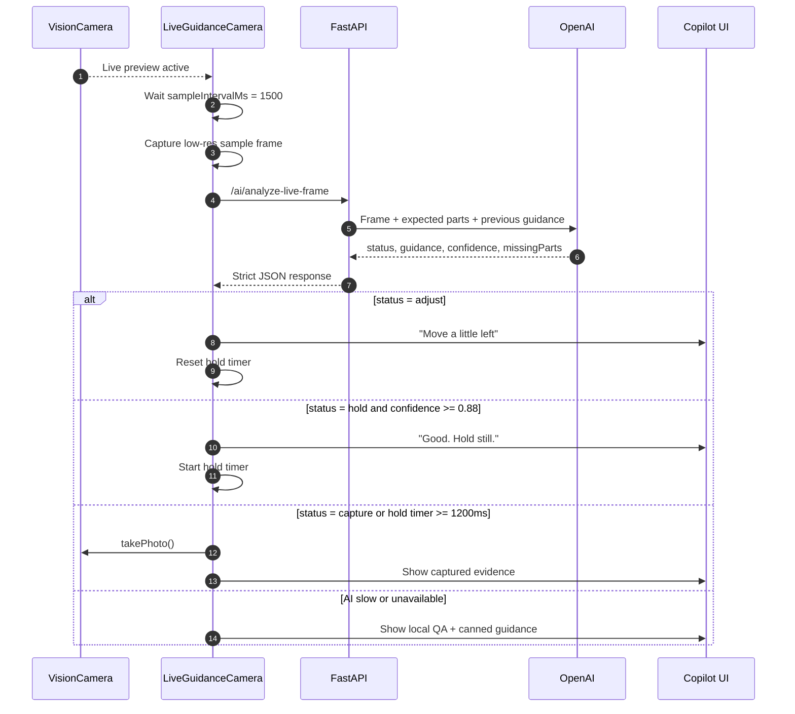
```mermaid
sequenceDiagram
  autonumber
  participant Cam as VisionCamera
  participant LG as LiveGuidanceCamera
  participant API as FastAPI
  participant AI as OpenAI
  participant UI as Copilot UI

  Cam-->>LG: Live preview active
  LG->>LG: Wait sampleIntervalMs = 1500
  LG->>LG: Capture low-res sample frame
  LG->>API: /ai/analyze-live-frame
  API->>AI: Frame + expected parts + previous guidance
  AI-->>API: status, guidance, confidence, missingParts
  API-->>LG: Strict JSON response

  alt status = adjust
    LG->>UI: "Move a little left"
    LG->>LG: Reset hold timer
  else status = hold and confidence >= 0.88
    LG->>UI: "Good. Hold still."
    LG->>LG: Start hold timer
  else status = capture or hold timer >= 1200ms
    LG->>Cam: takePhoto()
    LG->>UI: Show captured evidence
  else AI slow or unavailable
    LG->>UI: Show local QA + canned guidance
  end
```

## Live Guidance State Machine

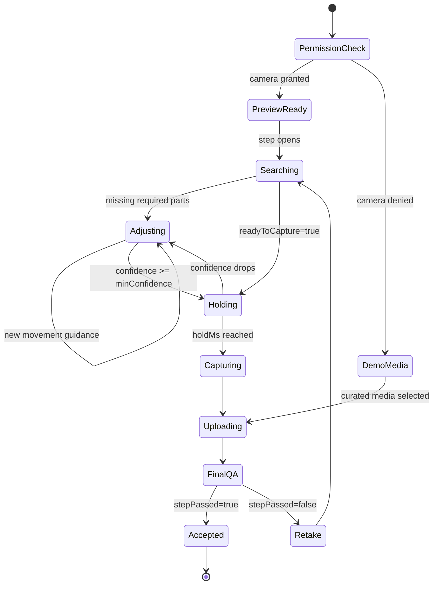
```mermaid
stateDiagram-v2
  [*] --> PermissionCheck
  PermissionCheck --> PreviewReady: camera granted
  PermissionCheck --> DemoMedia: camera denied

  PreviewReady --> Searching: step opens
  Searching --> Adjusting: missing required parts
  Searching --> Holding: readyToCapture=true
  Adjusting --> Adjusting: new movement guidance
  Adjusting --> Holding: confidence >= minConfidence
  Holding --> Adjusting: confidence drops
  Holding --> Capturing: holdMs reached
  Capturing --> Uploading
  Uploading --> FinalQA
  FinalQA --> Accepted: stepPassed=true
  FinalQA --> Retake: stepPassed=false
  Retake --> Searching
  Accepted --> [*]

  DemoMedia --> Uploading: curated media selected
```

## Guided Engine Check Sequence

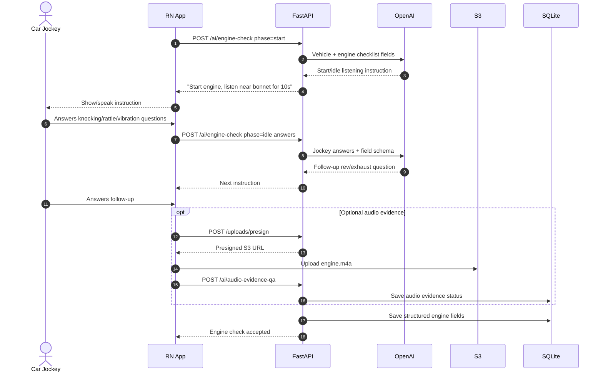
```mermaid
sequenceDiagram
  autonumber
  actor J as Car Jockey
  participant App as RN App
  participant API as FastAPI
  participant AI as OpenAI
  participant S3 as S3
  participant DDB as SQLite

  App->>API: POST /ai/engine-check phase=start
  API->>AI: Vehicle + engine checklist fields
  AI-->>API: Start/idle listening instruction
  API-->>App: "Start engine, listen near bonnet for 10s"
  App-->>J: Show/speak instruction
  J->>App: Answers knocking/rattle/vibration questions
  App->>API: POST /ai/engine-check phase=idle answers
  API->>AI: Jockey answers + field schema
  AI-->>API: Follow-up rev/exhaust question
  API-->>App: Next instruction
  J->>App: Answers follow-up
  opt Optional audio evidence
    App->>API: POST /uploads/presign
    API-->>App: Presigned S3 URL
    App->>S3: Upload engine.m4a
    App->>API: POST /ai/audio-evidence-qa
    API->>DDB: Save audio evidence status
  end
  API->>DDB: Save structured engine fields
  API-->>App: Engine check accepted
```

## External Report Delivery Sequence

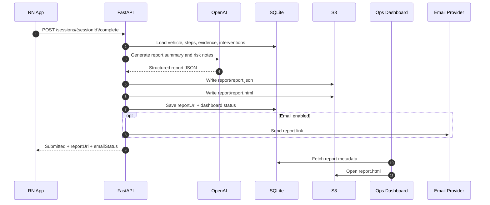
```mermaid
sequenceDiagram
  autonumber
  participant App as RN App
  participant API as FastAPI
  participant AI as OpenAI
  participant DDB as SQLite
  participant S3 as S3
  participant Dash as Ops Dashboard
  participant Mail as Email Provider

  App->>API: POST /sessions/{sessionId}/complete
  API->>DDB: Load vehicle, steps, evidence, interventions
  API->>AI: Generate report summary and risk notes
  AI-->>API: Structured report JSON
  API->>S3: Write report/report.json
  API->>S3: Write report/report.html
  API->>DDB: Save reportUrl + dashboard status
  opt Email enabled
    API->>Mail: Send report link
  end
  API-->>App: Submitted + reportUrl + emailStatus
  Dash->>DDB: Fetch report metadata
  Dash->>S3: Open report.html
```

## Inspection Step Types

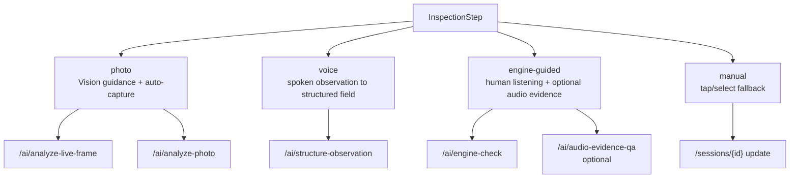
```mermaid
flowchart TD
  Step["InspectionStep"] --> Photo["photo<br/>Vision guidance + auto-capture"]
  Step --> Voice["voice<br/>spoken observation to structured field"]
  Step --> Engine["engine-guided<br/>human listening + optional audio evidence"]
  Step --> Manual["manual<br/>tap/select fallback"]

  Photo --> LiveFrame["/ai/analyze-live-frame"]
  Photo --> FinalPhoto["/ai/analyze-photo"]
  Voice --> Structure["/ai/structure-observation"]
  Engine --> EngineAPI["/ai/engine-check"]
  Engine --> AudioEvidence["/ai/audio-evidence-qa<br/>optional"]
  Manual --> SessionPatch["/sessions/{id} update"]
```

## Demo Inspection Plan

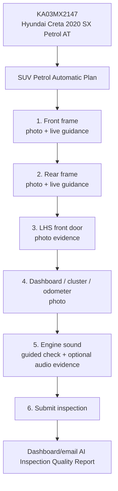
```mermaid
flowchart TD
  Vehicle["KA03MX2147<br/>Hyundai Creta 2020 SX Petrol AT"] --> Plan["SUV Petrol Automatic Plan"]
  Plan --> F["1. Front frame<br/>photo + live guidance"]
  F --> R["2. Rear frame<br/>photo + live guidance"]
  R --> LHS["3. LHS front door<br/>photo evidence"]
  LHS --> Dash["4. Dashboard / cluster / odometer<br/>photo"]
  Dash --> Engine["5. Engine sound<br/>guided check + optional audio evidence"]
  Engine --> Submit["6. Submit inspection"]
  Submit --> Final["Dashboard/email AI Inspection Quality Report"]
```

## Data Model

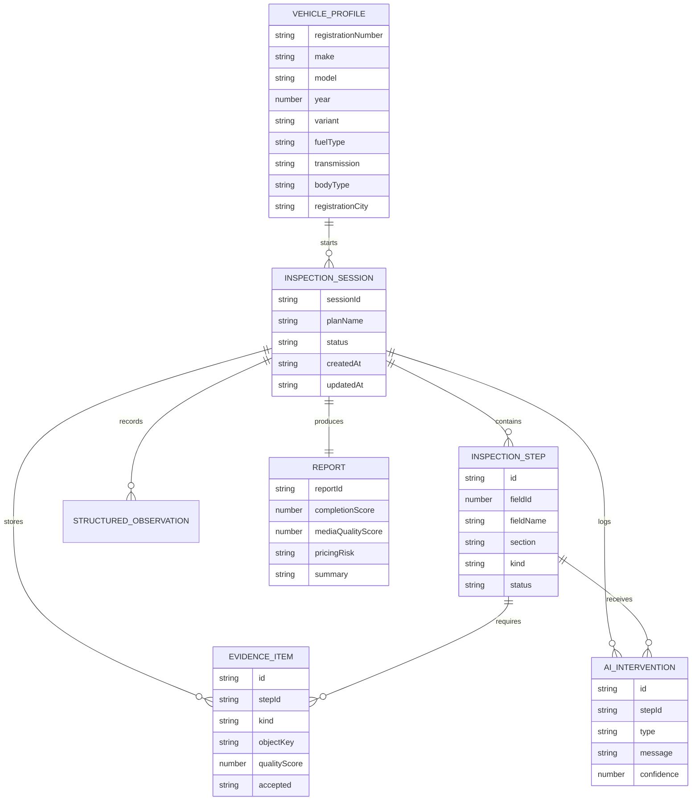
```mermaid
erDiagram
  VEHICLE_PROFILE ||--o{ INSPECTION_SESSION : starts
  INSPECTION_SESSION ||--o{ INSPECTION_STEP : contains
  INSPECTION_SESSION ||--o{ EVIDENCE_ITEM : stores
  INSPECTION_SESSION ||--o{ STRUCTURED_OBSERVATION : records
  INSPECTION_SESSION ||--o{ AI_INTERVENTION : logs
  INSPECTION_SESSION ||--|| REPORT : produces
  INSPECTION_STEP ||--o{ EVIDENCE_ITEM : requires
  INSPECTION_STEP ||--o{ AI_INTERVENTION : receives

  VEHICLE_PROFILE {
    string registrationNumber
    string make
    string model
    number year
    string variant
    string fuelType
    string transmission
    string bodyType
    string registrationCity
  }

  INSPECTION_SESSION {
    string sessionId
    string planName
    string status
    string createdAt
    string updatedAt
  }

  INSPECTION_STEP {
    string id
    number fieldId
    string fieldName
    string section
    string kind
    string status
  }

  EVIDENCE_ITEM {
    string id
    string stepId
    string kind
    string objectKey
    number qualityScore
    string accepted
  }

  AI_INTERVENTION {
    string id
    string stepId
    string type
    string message
    number confidence
  }

  REPORT {
    string reportId
    number completionScore
    number mediaQualityScore
    string pricingRisk
    string summary
  }
```

## API Contract Map

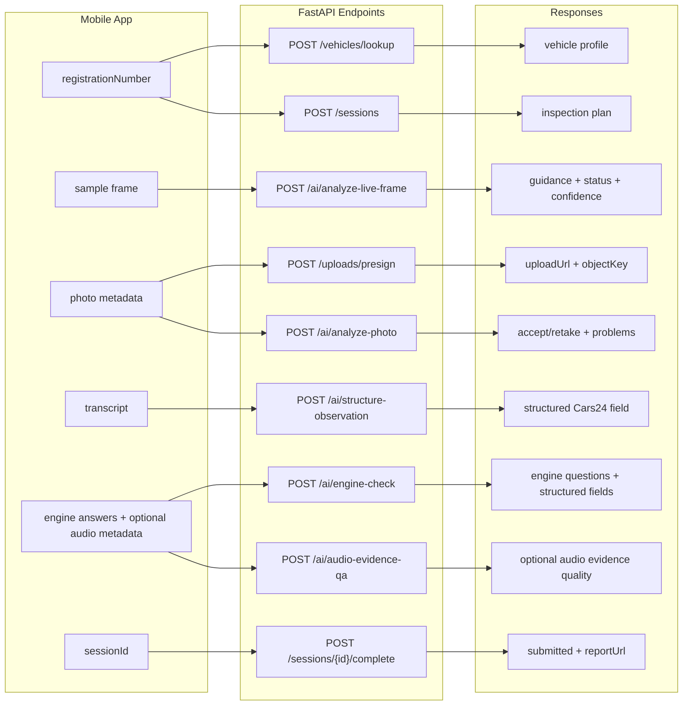
```mermaid
flowchart LR
  subgraph Client["Mobile App"]
    A["registrationNumber"]
    B["sample frame"]
    C["photo metadata"]
    D["transcript"]
    E["engine answers + optional audio metadata"]
    F["sessionId"]
  end

  subgraph API["FastAPI Endpoints"]
    V["POST /vehicles/lookup"]
    S["POST /sessions"]
    U["POST /uploads/presign"]
    LF["POST /ai/analyze-live-frame"]
    P["POST /ai/analyze-photo"]
    SO["POST /ai/structure-observation"]
    EG["POST /ai/engine-check"]
    AQ["POST /ai/audio-evidence-qa"]
    R["POST /sessions/{id}/complete"]
  end

  subgraph Responses["Responses"]
    Vehicle["vehicle profile"]
    Plan["inspection plan"]
    Upload["uploadUrl + objectKey"]
    Guidance["guidance + status + confidence"]
    PhotoQA["accept/retake + problems"]
    Field["structured Cars24 field"]
    EngineResult["engine questions + structured fields"]
    AudioResult["optional audio evidence quality"]
    Report["submitted + reportUrl"]
  end

  A --> V --> Vehicle
  A --> S --> Plan
  C --> U --> Upload
  B --> LF --> Guidance
  C --> P --> PhotoQA
  D --> SO --> Field
  E --> EG --> EngineResult
  E --> AQ --> AudioResult
  F --> R --> Report
```

## Endpoint Payload Cheatsheet

| Endpoint | Request In | Response Out |
|---|---|---|
| `POST /vehicles/lookup` | `registrationNumber` | `vehicle` |
| `POST /sessions` | `registrationNumber` | `sessionId`, `vehicle`, `plan.steps[]` |
| `POST /uploads/presign` | `sessionId`, `stepId`, `kind`, `contentType` | `uploadUrl`, `objectKey` |
| `POST /ai/analyze-live-frame` | `sessionId`, `stepId`, `frameBase64`, `expectedParts[]` | `guidance`, `status`, `readyToCapture`, `confidence` |
| `POST /ai/analyze-photo` | `sessionId`, `stepId`, `imageUrl`, `expectedParts[]` | `stepPassed`, `visibleParts[]`, `problems[]`, `nextInstruction` |
| `POST /ai/structure-observation` | `sessionId`, `stepId`, `transcript` | `fieldId`, `issue`, `severity`, `confidence` |
| `POST /ai/engine-check` | `sessionId`, `stepId`, `phase`, `jockeyAnswers[]` | `nextInstruction`, `questions[]`, `structuredFields[]`, `confidence` |
| `POST /ai/audio-evidence-qa` | `sessionId`, `audioUrl`, `localMetrics` | `accepted`, `qualityScore`, `evidenceNote` |
| `GET /voice/config` | none | `provider`, `llmProvider`, `transport`, `startUrl`, `model`, `voice`, `ready`, `missing[]` |
| `POST /voice/transcript-turn` | `sessionId`, `stepId`, `transcript` | `type`, `message`, `structuredFields`, `nextStep`, `session` |
| `POST /sessions/{id}/complete` | `sessionId` | `status`, `reportUrl`, `dashboardUrl`, `emailStatus` |

## AI Contract Flow

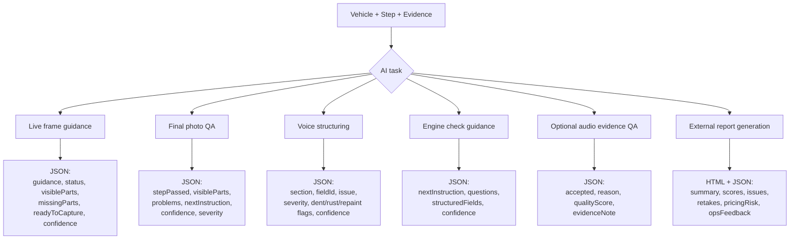
```mermaid
flowchart TD
  Input["Vehicle + Step + Evidence"] --> Router{"AI task"}

  Router --> Live["Live frame guidance"]
  Router --> Photo["Final photo QA"]
  Router --> Voice["Voice structuring"]
  Router --> Engine["Engine check guidance"]
  Router --> Audio["Optional audio evidence QA"]
  Router --> Report["External report generation"]

  Live --> LiveJSON["JSON:<br/>guidance, status, visibleParts,<br/>missingParts, readyToCapture, confidence"]
  Photo --> PhotoJSON["JSON:<br/>stepPassed, visibleParts,<br/>problems, nextInstruction,<br/>confidence, severity"]
  Voice --> VoiceJSON["JSON:<br/>section, fieldId, issue,<br/>severity, dent/rust/repaint flags, confidence"]
  Engine --> EngineJSON["JSON:<br/>nextInstruction, questions,<br/>structuredFields, confidence"]
  Audio --> AudioJSON["JSON:<br/>accepted, reason, qualityScore,<br/>evidenceNote"]
  Report --> ReportJSON["HTML + JSON:<br/>summary, scores, issues,<br/>retakes, pricingRisk, opsFeedback"]
```

## Storage Layout

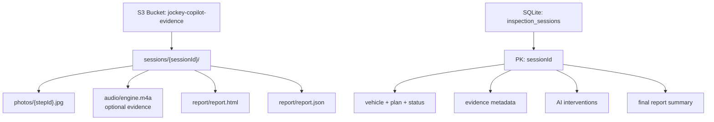
```mermaid
flowchart TD
  Bucket["S3 Bucket: jockey-copilot-evidence"] --> Session["sessions/{sessionId}/"]
  Session --> Photos["photos/{stepId}.jpg"]
  Session --> Audio["audio/engine.m4a<br/>optional evidence"]
  Session --> ReportHTML["report/report.html"]
  Session --> ReportJSON["report/report.json"]

  Table["SQLite: inspection_sessions"] --> PK["PK: sessionId"]
  PK --> Meta["vehicle + plan + status"]
  PK --> Evidence["evidence metadata"]
  PK --> Interventions["AI interventions"]
  PK --> FinalReport["final report summary"]
```

## Deployment Diagram

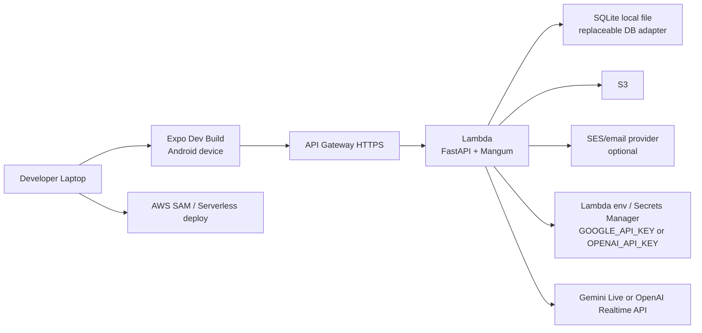
```mermaid
flowchart LR
  Dev["Developer Laptop"] --> Expo["Expo Dev Build<br/>Android device"]
  Dev --> SAM["AWS SAM / Serverless deploy"]

  Expo --> APIGW["API Gateway HTTPS"]
  APIGW --> Lambda["Lambda<br/>FastAPI + Mangum"]
  Lambda --> DDB["SQLite local file<br/>replaceable DB adapter"]
  Lambda --> S3["S3"]
  Lambda --> SES["SES/email provider<br/>optional"]
  Lambda --> Secrets["Lambda env / Secrets Manager<br/>GOOGLE_API_KEY or OPENAI_API_KEY"]
  Lambda --> VoiceLLM["Gemini Live or OpenAI Realtime API"]
```

## Error And Fallback Flow

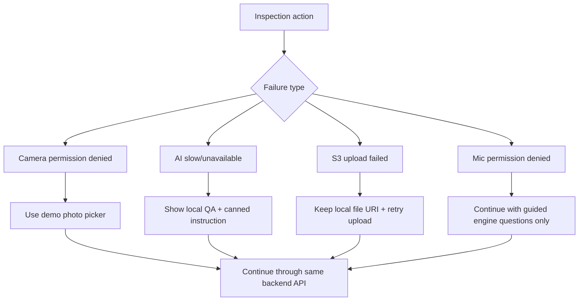
```mermaid
flowchart TD
  Action["Inspection action"] --> Failure{"Failure type"}
  Failure --> CameraDenied["Camera permission denied"]
  Failure --> AISlow["AI slow/unavailable"]
  Failure --> UploadFail["S3 upload failed"]
  Failure --> AudioDenied["Mic permission denied"]

  CameraDenied --> DemoPhoto["Use demo photo picker"]
  AISlow --> LocalQA["Show local QA + canned instruction"]
  UploadFail --> LocalURI["Keep local file URI + retry upload"]
  AudioDenied --> NoAudio["Continue with guided engine questions only"]

  DemoPhoto --> SameAPI["Continue through same backend API"]
  LocalQA --> SameAPI
  LocalURI --> SameAPI
  NoAudio --> SameAPI
```

## Build Board

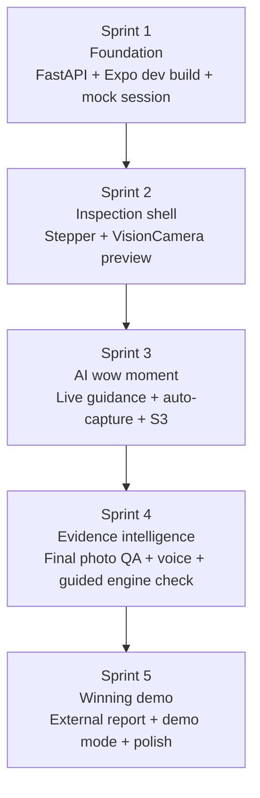
```mermaid
flowchart TD
  S1["Sprint 1<br/>Foundation<br/>FastAPI + Expo dev build + mock session"] --> S2["Sprint 2<br/>Inspection shell<br/>Stepper + VisionCamera preview"]
  S2 --> S3["Sprint 3<br/>AI wow moment<br/>Live guidance + auto-capture + S3"]
  S3 --> S4["Sprint 4<br/>Evidence intelligence<br/>Final photo QA + voice + guided engine check"]
  S4 --> S5["Sprint 5<br/>Winning demo<br/>External report + demo mode + polish"]
```

## Build Order Checklist

| Order | Build Unit | Done When |
|---:|---|---|
| 1 | FastAPI skeleton | `/health` works locally |
| 2 | Expo dev build skeleton | Android app opens |
| 3 | Mock vehicle lookup | Registration returns Creta demo profile |
| 4 | Session + plan generation | App receives ordered inspection steps |
| 5 | Stepper UI | Jockey can move through steps |
| 6 | VisionCamera preview | Camera permission + live preview works |
| 7 | Live frame endpoint | Frame returns short guidance JSON |
| 8 | Auto-capture | `readyToCapture` hold triggers `takePhoto()` |
| 9 | Presigned upload | Photo reaches S3 |
| 10 | Final photo QA | Accept/retake works for one photo step |
| 11 | Voice observation | Transcript maps to Cars24 field |
| 12 | Guided engine check | App gives listen instructions and structures Jockey answers |
| 13 | Optional audio evidence | Recording uploads and is marked usable/unusable as evidence |
| 14 | External report | Backend writes `report.html` and `report.json` for dashboard/email |
| 15 | Demo mode | Curated media can run the same flow |

## Non-Negotiable Interfaces

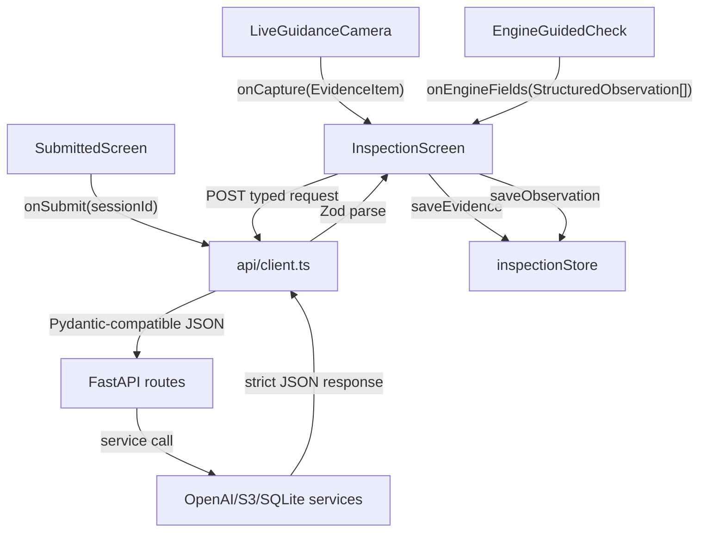
```mermaid
flowchart TD
  A["LiveGuidanceCamera"] -->|"onCapture(EvidenceItem)"| B["InspectionScreen"]
  G["EngineGuidedCheck"] -->|"onEngineFields(StructuredObservation[])"| B
  H["SubmittedScreen"] -->|"onSubmit(sessionId)"| D
  B -->|"saveEvidence"| C["inspectionStore"]
  B -->|"saveObservation"| C
  B -->|"POST typed request"| D["api/client.ts"]
  D -->|"Pydantic-compatible JSON"| E["FastAPI routes"]
  E -->|"service call"| F["OpenAI/S3/SQLite services"]
  F -->|"strict JSON response"| D
  D -->|"Zod parse"| B
```

## Hack Scope Boundary

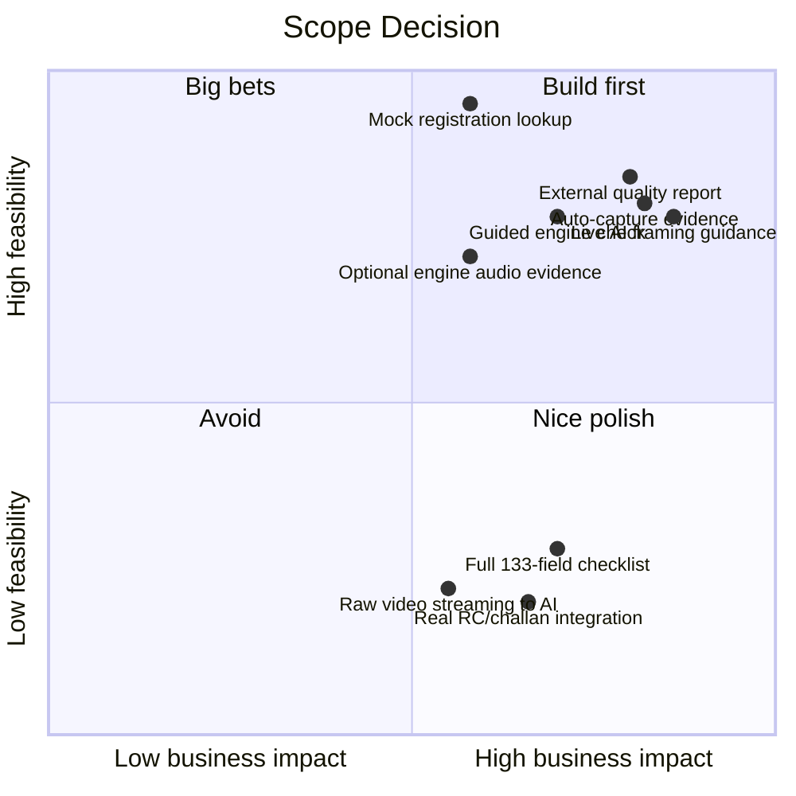
```mermaid
quadrantChart
  title Scope Decision
  x-axis Low business impact --> High business impact
  y-axis Low feasibility --> High feasibility
  quadrant-1 Build first
  quadrant-2 Big bets
  quadrant-3 Avoid
  quadrant-4 Nice polish
  "Live AI framing guidance": [0.86, 0.78]
  "Auto-capture evidence": [0.82, 0.80]
  "Mock registration lookup": [0.58, 0.95]
  "External quality report": [0.80, 0.84]
  "Guided engine check": [0.70, 0.78]
  "Optional engine audio evidence": [0.58, 0.72]
  "Full 133-field checklist": [0.70, 0.28]
  "Raw video streaming to AI": [0.55, 0.22]
  "Real RC/challan integration": [0.66, 0.20]
```
