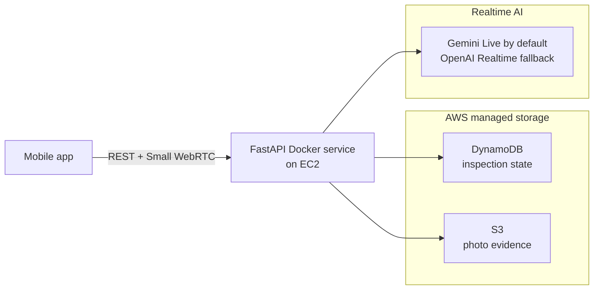
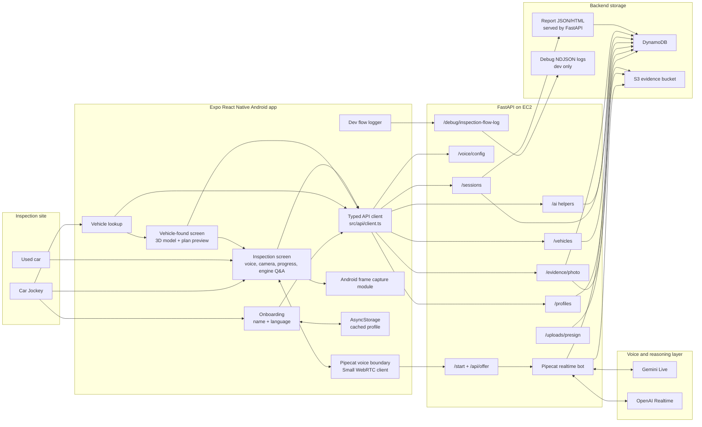
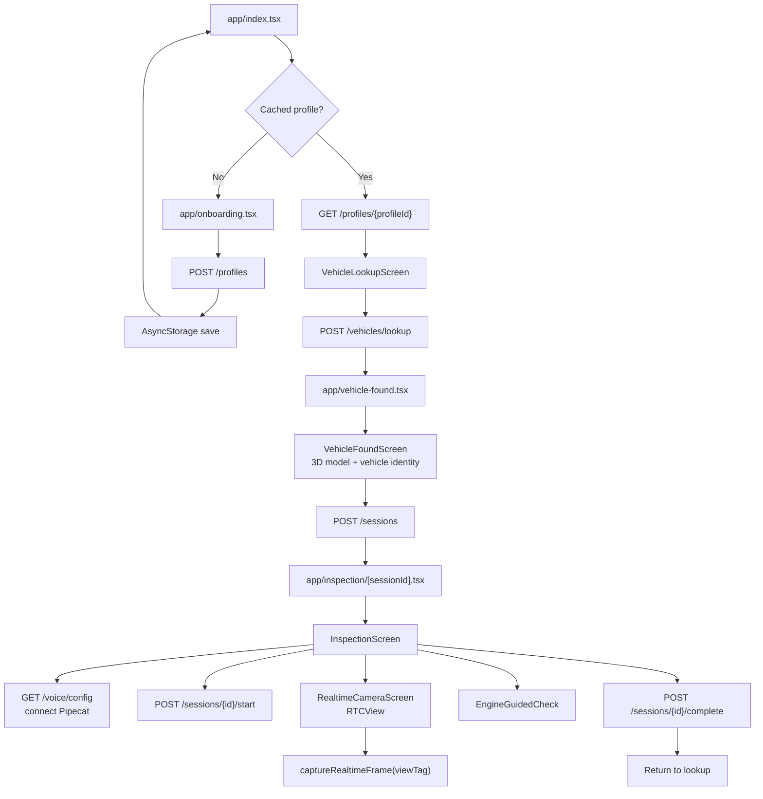
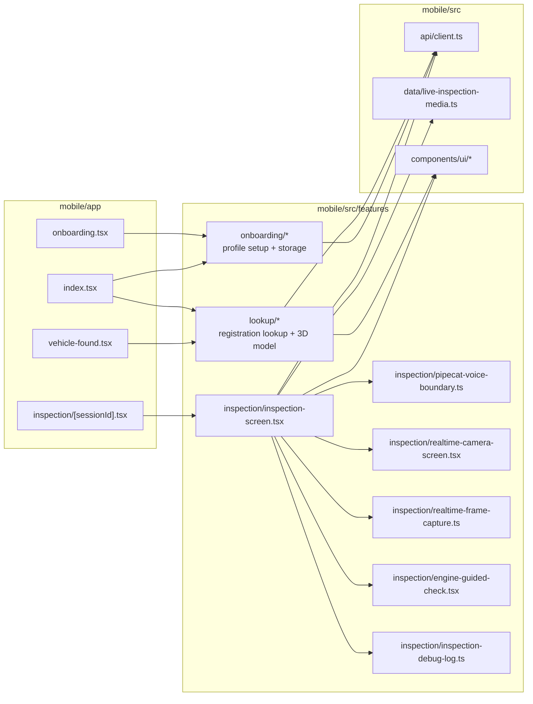
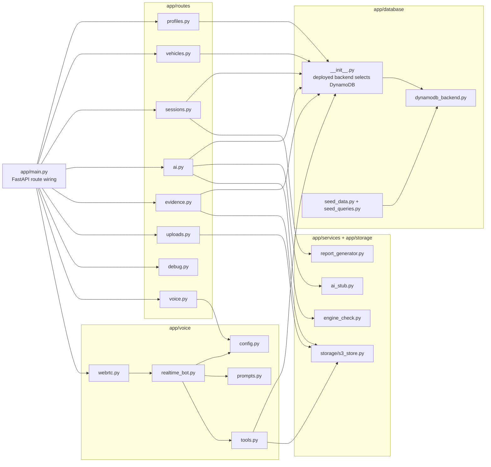
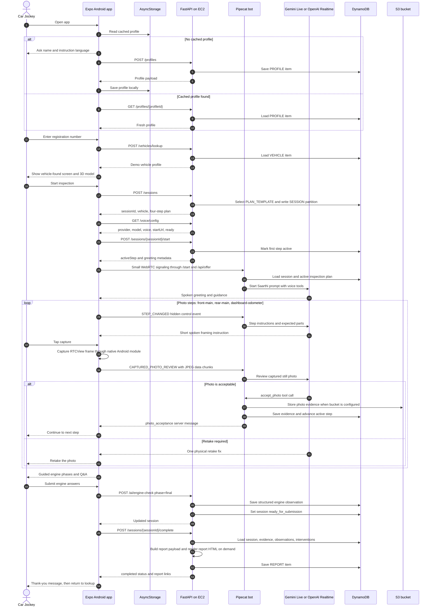
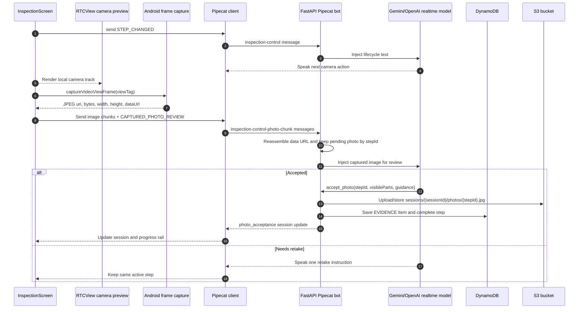
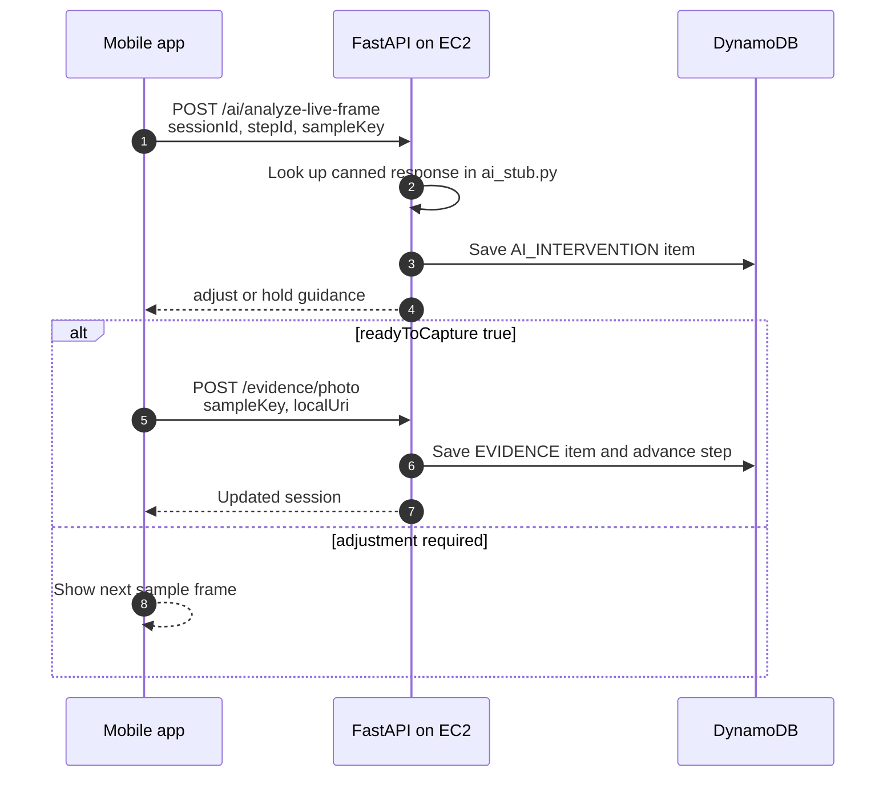
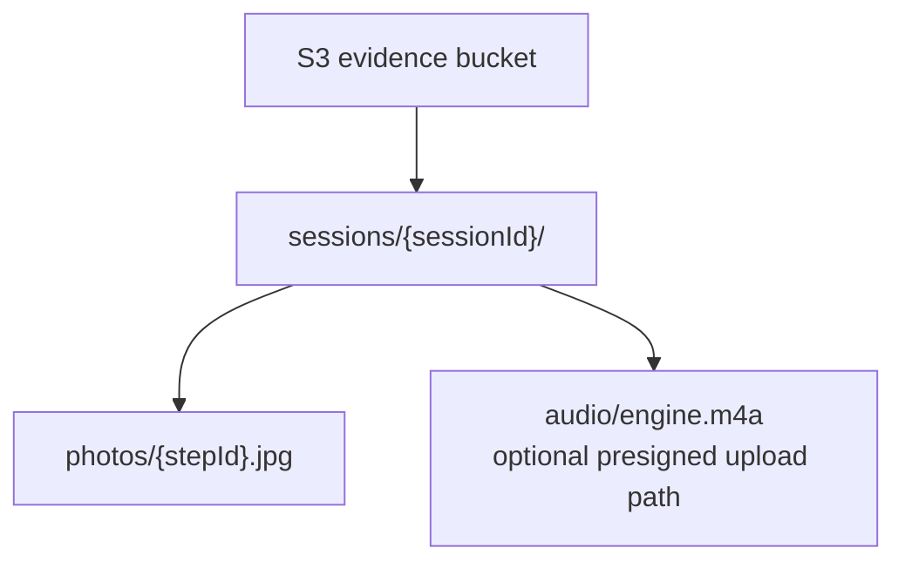
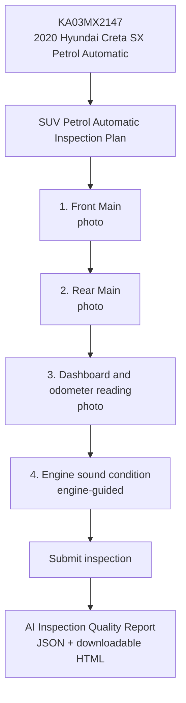

# ARCHITECTURE: Cars24 Jockey Copilot

This document describes the current implementation state of the hackathon app.

The backend demo deployment is an EC2-hosted FastAPI Docker service backed by DynamoDB and an S3 evidence bucket. The code still contains local SQLite/filesystem adapters for local development and tests, but the current backend architecture should be read as EC2 + DynamoDB + S3.

## Decision Map

| Area | Current Choice | Why It Exists |
|---|---|---|
| Mobile app | Expo React Native Android development build | Native Android demo with microphone, camera, WebRTC, and a custom frame-capture module |
| Navigation | Expo Router | Small route surface: onboarding, lookup, vehicle confirmation, inspection |
| Camera | Pipecat Small WebRTC local camera track rendered with `RTCView` | The realtime voice session owns camera/mic transport, and the app captures the visible RTC view when needed |
| Frame capture | Android native `RealtimeFrameCaptureModule` | Captures the rendered realtime camera frame as a JPEG for photo review and evidence |
| Backend hosting | FastAPI in Docker on EC2 | Simple deployed backend service, no Lambda/Mangum/API Gateway in the current deployment |
| Persistence | DynamoDB backend adapter | EC2 service remains stateless; session, plan, evidence metadata, observations, interventions, profiles, and reports live in DynamoDB |
| Media storage | S3 evidence bucket | Stores photo evidence when `JOCKEY_COPILOT_S3_BUCKET` is configured; presigned uploads are also available |
| Voice runtime | Pipecat Small WebRTC backend bot | Keeps realtime LLM keys on the backend and streams voice/camera through the backend-controlled runtime |
| Voice LLM | Gemini Live by default, OpenAI Realtime rollback | Backend can switch providers through `VOICE_LLM_PROVIDER` without changing mobile code |
| Vehicle data | Seeded demo vehicles | Stable hackathon path with the same interface a real RC/Cars24 provider could replace |
| Report output | FastAPI report JSON/HTML endpoints backed by DynamoDB | Completion creates report metadata and serves pricing/audit report views from the backend |

## Deployment Architecture



## System Architecture



## App Surface Map



## Mobile Module Map



## Backend Module Map



## End-To-End Runtime Sequence



## Realtime Photo Review Sequence



## Sample Fallback Sequence

The realtime path above is the primary demo path. The app and backend also keep deterministic sample-frame endpoints for reliable local demos and tests.



## DynamoDB Logical Layout

```mermaid
erDiagram
  VEHICLE ||--o{ INSPECTION_SESSION : starts
  PROFILE ||--o{ INSPECTION_SESSION : used_by
  PLAN_TEMPLATE ||--o{ PLAN_STEP : defines
  INSPECTION_SESSION ||--o{ SESSION_STEP : snapshots
  INSPECTION_SESSION ||--o{ EVIDENCE_ITEM : stores
  INSPECTION_SESSION ||--o{ AI_INTERVENTION : logs
  INSPECTION_SESSION ||--o{ STRUCTURED_OBSERVATION : records
  INSPECTION_SESSION ||--|| REPORT : produces

  VEHICLE {
    string PK "VEHICLE#registration"
    string SK "META"
    string make
    string model
    string fuelType
    string transmission
  }

  PROFILE {
    string PK "PROFILE#profileId"
    string SK "META"
    string name
    string languageCode
  }

  PLAN_TEMPLATE {
    string PK "PLAN_TEMPLATE#templateId"
    string SK "META"
    string bodyType
    string fuelType
    string transmission
  }

  PLAN_STEP {
    string PK "PLAN_TEMPLATE#templateId"
    string SK "STEP#sortOrder"
    string fieldName
    string kind
  }

  INSPECTION_SESSION {
    string PK "SESSION#sessionId"
    string SK "META"
    string status
    object vehicle
    string planName
  }

  SESSION_STEP {
    string PK "SESSION#sessionId"
    string SK "STEP#sortOrder"
    string stepId
    string status
  }

  EVIDENCE_ITEM {
    string PK "SESSION#sessionId"
    string SK "EVIDENCE#createdAt#id"
    string objectKey
    float qualityScore
  }

  AI_INTERVENTION {
    string PK "SESSION#sessionId"
    string SK "AI#createdAt#id"
    string type
    string message
  }

  STRUCTURED_OBSERVATION {
    string PK "SESSION#sessionId"
    string SK "OBS#createdAt#id"
    string issue
    string severity
  }

  REPORT {
    string PK "SESSION#sessionId"
    string SK "REPORT"
    float completionScore
    float mediaQualityScore
    string pricingRisk
  }
```

## S3 Object Layout



Current report JSON and HTML are generated from DynamoDB-backed report payloads and served by FastAPI at `/sessions/{sessionId}/report` and `/sessions/{sessionId}/report.html`.

## Current Demo Inspection Plan



## API Surface

| Endpoint | Owner | Current role |
|---|---|---|
| `GET /health` | `app/main.py` | EC2/container health check |
| `POST /profiles` | `routes/profiles.py` | Create Jockey profile |
| `GET /profiles` | `routes/profiles.py` | List profiles |
| `GET /profiles/{profileId}` | `routes/profiles.py` | Refresh cached mobile profile |
| `POST /vehicles/lookup` | `routes/vehicles.py` | Lookup seeded demo registration |
| `GET /vehicles` | `routes/vehicles.py` | List seeded demo vehicles |
| `POST /sessions` | `routes/sessions.py` | Create session and snapshot dynamic plan |
| `POST /sessions/{sessionId}/start` | `routes/sessions.py` | Activate first step and return greeting metadata |
| `GET /sessions/{sessionId}` | `routes/sessions.py` | Load session state |
| `POST /sessions/{sessionId}/complete` | `routes/sessions.py` | Validate completion and create report |
| `POST /sessions/{sessionId}/report` | `routes/sessions.py` | Create report without marking completion again |
| `GET /sessions/{sessionId}/report` | `routes/sessions.py` | Return report JSON |
| `GET /sessions/{sessionId}/report.html` | `routes/sessions.py` | Return downloadable report HTML |
| `POST /ai/analyze-live-frame` | `routes/ai.py` | Deterministic sample-frame guidance |
| `POST /ai/structure-observation` | `routes/ai.py` | Structure a transcript for a step that needs observation |
| `POST /ai/engine-check` | `routes/ai.py` | Structure engine Q&A and mark ready for submission |
| `POST /evidence/photo` | `routes/evidence.py` | Store photo evidence and advance photo step |
| `POST /uploads/presign` | `routes/uploads.py` | Create S3 presigned upload URL |
| `GET /voice/config` | `routes/voice.py` | Return Pipecat provider/model/voice readiness |
| `POST /voice/transcript-turn` | `routes/voice.py` | Fallback transcript-to-session update path |
| `POST /start` | `voice/webrtc.py` | Start Small WebRTC session |
| `POST /api/offer` | `voice/webrtc.py` | WebRTC offer endpoint |
| `PATCH /api/offer` | `voice/webrtc.py` | WebRTC ICE candidate endpoint |
| `POST /debug/inspection-flow-log` | `routes/debug.py` | Dev-only NDJSON inspection flow log |

## Environment Contract

| Variable | Used by | Meaning |
|---|---|---|
| `JOCKEY_COPILOT_STORAGE_BACKEND=dynamodb` | `app.database.__init__` | Selects the deployed DynamoDB adapter |
| `JOCKEY_COPILOT_DDB_TABLE` | `dynamodb_backend.py` | DynamoDB table name |
| `JOCKEY_COPILOT_S3_BUCKET` | `storage/s3_store.py`, `routes/evidence.py`, `routes/uploads.py` | Evidence bucket name |
| `AWS_REGION` | boto3 clients | DynamoDB/S3 region |
| `VOICE_LLM_PROVIDER` | `voice/config.py` | `gemini` default or `openai` rollback |
| `GOOGLE_API_KEY` / `GEMINI_API_KEY` | Gemini Live runtime | Required for Gemini voice readiness |
| `OPENAI_API_KEY` | OpenAI Realtime runtime | Required only when `VOICE_LLM_PROVIDER=openai` |
| `JOCKEY_COPILOT_VOICE_BASE_URL` | mobile voice config | Base URL returned by `/voice/config` |
| `JOCKEY_COPILOT_ICE_SERVERS_JSON` | Small WebRTC | Optional STUN/TURN override |
| `JOCKEY_COPILOT_FLOW_LOG_PATH` | debug route | Dev-only local NDJSON flow log path |

## Current Boundaries

- The backend is not currently a Lambda/Mangum service. It is a Dockerized FastAPI service running on EC2.
- The deployed backend state is DynamoDB-backed. SQLite is a local/test adapter, not the deployed architecture.
- S3 is the backend media bucket for evidence objects and presigned upload URLs.
- The mobile app does not hold AI provider keys. Voice provider configuration and readiness are resolved by the backend.
- The realtime photo-review path uses the Pipecat voice bot and tool calls to accept evidence. The `/ai/analyze-live-frame` path is a deterministic sample fallback used by tests and local demo flows.
- The current seeded plan has four steps: `front-main`, `rear-main`, `dashboard-odometer`, and `engine-sound`.
