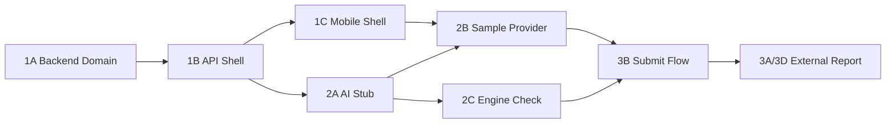

# Parallel Sprint Plan: Cars24 Jockey Copilot

## Working Rules For Agents

- Use Makefile commands from the repo root unless a task explicitly says otherwise.
- Backend Make targets use `uv` underneath.
- Do not edit files owned by another task unless the task says so.
- Keep backend contracts in Pydantic and mobile contracts in TypeScript aligned by field name.
- Sample media mode is mandatory; real camera mode is an upgrade path.
- Mobile app ends at "inspection submitted"; report is external HTML/JSON.
- Engine flow is guided Jockey inspection with optional audio evidence, not AI mechanical diagnosis.

## Root Commands

```bash
make help
make doctor
```

## Backend Commands

```bash
make backend-install
make backend-test
make backend-dev
make backend-check
```

## Mobile Commands

```bash
make mobile-install
make mobile-start
make mobile-android
make mobile-ios
```

## Android Commands

```bash
make android-check
make android-ready
make android-reverse
make android-unreverse
```

---

# Sprint 1: Contracts, Backend Core, Mobile Shell

**Goal:** Everyone can work against stable contracts. The app can create an inspection session and render the five-step sample flow without real AI/camera yet.

**Parallel Tasks**

| Task | Agent | Owns | Depends On | Acceptance |
|---|---|---|---|---|
| 1A Backend API Shell | Backend API Agent | `backend/app/main.py`, `backend/app/routes/vehicles.py`, `backend/app/routes/sessions.py`, API tests | Task 1A model names | `/health`, `/vehicles/lookup`, `/sessions`, `/sessions/{id}` work |
| 1B Backend Domain | Backend Agent | `backend/pyproject.toml`, `backend/app/models.py`, `backend/app/data.py`, `backend/app/services/vehicle_lookup.py`, `backend/app/services/plan_generator.py`, backend tests | Nothing | `make backend-test` passes for domain tests |
| 1C Mobile Shell | Mobile Agent | `mobile/app/*`, `mobile/src/features/lookup/*`, `mobile/src/features/inspection/*`, `mobile/src/api/client.ts` | API response shape from 1B | Registration screen creates session and opens inspection screen |
| 1D UI System | UI Agent | `mobile/src/components/*`, shared colors/layout primitives | Nothing | Lookup and inspection screens use same visual components |

## Task 1A: Backend API Shell

**Deliver:**

- `GET /health`
- `POST /vehicles/lookup`
- `POST /sessions`
- `GET /sessions/{sessionId}`
- In-memory session store for hack.

**Do Not Touch:**

- Mobile files.
- AI prompt/stub logic.

## Task 1B: Backend Domain

**Deliver:**

- Demo vehicle lookup for `KA03MX2147`.
- `backend/pyproject.toml` with FastAPI, Pydantic, pytest, uvicorn, and httpx.
- Five-step plan:
  - `front-main`
  - `rear-main`
  - `lhs-front-door`
  - `dashboard-odometer`
  - `engine-sound`
- Pydantic response models with camelCase API aliases.

**Do Not Touch:**

- Mobile files.
- AI routes.
- Report generator.

## Task 1C: Mobile Shell

**Deliver:**

- Expo Router app.
- Vehicle lookup screen.
- Inspection screen with stepper.
- API client with typed request/response objects.
- Demo mode toggle defaulted on.

**Do Not Touch:**

- Backend files.
- VisionCamera implementation.

## Task 1D: UI System

**Deliver:**

- `Button`, `Card`, `StatusPill`, `StepHeader`, `ProgressRail`.
- Quiet operational visual style, not landing-page style.
- Components that fit Android narrow widths.

**Do Not Touch:**

- API client.
- Backend files.

---

# Sprint 2: AI Copilot Loop, Evidence, Engine Check

**Goal:** The demo shows the core wow moment: bad sample frame gets guidance, good frame auto-accepts, voice/typed observation becomes structured field, engine check is guided, and evidence can be submitted.

**Parallel Tasks**

| Task | Agent | Owns | Depends On | Acceptance |
|---|---|---|---|---|
| 2A AI Stub + OpenAI Boundary | AI Backend Agent | `backend/app/services/ai_stub.py`, `backend/app/routes/ai.py`, AI tests | Sprint 1 models | Sample keys return deterministic guidance; OpenAI wrapper can be swapped in later |
| 2B Sample Media Provider | Mobile Agent | `mobile/src/data/sampleMedia.ts`, `mobile/src/features/inspection/SampleGuidanceCard.tsx` | Sprint 1 mobile shell | Sample flow shows adjust -> hold -> accepted without camera |
| 2C Engine Guided Check | Full-stack Agent | `backend/app/services/engine_check.py`, `mobile/src/features/engine/EngineGuidedCheck.tsx` | Sprint 1 models/API client | Jockey answers become structured engine fields |
| 2D Upload + Evidence Contracts | Backend Agent | `backend/app/routes/uploads.py`, evidence model fields | Sprint 1 models | Local presign shape matches future S3 shape |
| 2E VisionCamera Provider | Mobile Native Agent | `mobile/src/features/inspection/LiveGuidanceCamera.tsx`, app permissions | Mobile shell | Android camera preview works behind same interface as sample provider |

## Task 2A: AI Stub + OpenAI Boundary

**Deliver:**

- `POST /ai/analyze-live-frame`
- `POST /ai/analyze-photo`
- `POST /ai/structure-observation`
- Deterministic sample-key behavior:
  - `front-main-bad-cropped` -> `adjust`
  - `front-main-good` -> `hold`, `readyToCapture=true`
  - `dashboard-dark` -> retake/brightness guidance
  - `dashboard-good` -> accepted
  - `lhs-door-scratch` -> asks defect question
- Keep OpenAI call behind a service interface, but default to stub until API key is configured.

**Do Not Touch:**

- Mobile camera code.
- Report delivery.

## Task 2B: Sample Media Provider

**Deliver:**

- Demo mode flow that uses sample keys instead of real images.
- UI shows "AI says move left", then "good hold still", then accepted.
- Same API calls as real media mode.

**Do Not Touch:**

- Backend AI decision rules.
- VisionCamera provider.

## Task 2C: Engine Guided Check

**Deliver:**

- `POST /ai/engine-check`
- Mobile engine step with phases:
  - start
  - idle listen
  - gentle rev
  - exhaust listen
  - final structured answer
- Optional audio evidence slot, but do not block if mic is unavailable.

**Do Not Touch:**

- Report HTML styling.
- Camera provider.

## Task 2D: Upload + Evidence Contracts

**Deliver:**

- `POST /uploads/presign`
- Local dev response:

```json
{
  "uploadUrl": "http://localhost:8000/local-upload/sessions/insp_123/photos/front-main.jpg",
  "objectKey": "sessions/insp_123/photos/front-main.jpg"
}
```

- Keep names compatible with AWS S3 presigned URL later.

**Do Not Touch:**

- Mobile UI except API type if needed.

## Task 2E: VisionCamera Provider

**Deliver:**

- Permission request.
- Live preview.
- `takePhoto()` auto-capture path.
- Interface-compatible output with sample provider.

**Do Not Touch:**

- Sample provider behavior.
- Backend AI logic.

---

# Sprint 3: External Report, Integration, Demo Hardening

**Goal:** A judge can watch one reliable end-to-end run: registration -> AI-guided captures -> structured observations -> guided engine check -> submit -> external report link.

**Parallel Tasks**

| Task | Agent | Owns | Depends On | Acceptance |
|---|---|---|---|---|
| 3A Report Generator | Backend Agent | `backend/app/services/report_generator.py`, `backend/.local/reports/*`, tests | Sprint 2 evidence/observations | `report.html` and `report.json` generated |
| 3B Submit Flow | Full-stack Agent | `POST /sessions/{id}/complete`, mobile submitted screen | 3A contract | Mobile shows submitted + report link |
| 3C Demo Reliability | QA Agent | demo checklist, fallback sample data, smoke scripts | Sprints 1-2 | Full sample flow works three times in a row |
| 3D Pitch Dashboard | Frontend Agent | lightweight dashboard or static report viewer | 3A report artifacts | Report opens outside mobile app and looks judge-ready |
| 3E Polish | Mobile UI Agent | haptics, loading states, status copy, error states | Main mobile screens | App feels like an operational Cars24 tool |

## Task 3A: Report Generator

**Deliver:**

- Local artifact paths:
  - `backend/.local/reports/{sessionId}/report.html`
  - `backend/.local/reports/{sessionId}/report.json`
- Report sections:
  - vehicle
  - completed fields
  - accepted/rejected captures
  - AI interventions
  - guided engine answers
  - optional audio evidence status
  - pricing/audit risk notes

**Do Not Touch:**

- Mobile capture flow.

## Task 3B: Submit Flow

**Deliver:**

- `POST /sessions/{sessionId}/complete`
- Mobile `SubmittedScreen`.
- Response includes:

```json
{
  "status": "submitted",
  "reportUrl": "http://localhost:8000/reports/insp_123/report.html",
  "dashboardUrl": "http://localhost:8000/dashboard/insp_123",
  "emailStatus": "not_configured"
}
```

**Do Not Touch:**

- Report HTML internals.

## Task 3C: Demo Reliability

**Deliver:**

- Scripted demo path in `DEMO_RUNBOOK.md`.
- Known-good sample sequence.
- Known-failure recovery notes.

**Do Not Touch:**

- Core contracts.

## Task 3D: Pitch Dashboard

**Deliver:**

- External report viewer, either:
  - FastAPI-served HTML report, or
  - tiny web dashboard.
- Must not live inside the mobile app.

**Do Not Touch:**

- Mobile submitted screen beyond opening/report link.

## Task 3E: Polish

**Deliver:**

- Crisp status text:
  - "Move a little left"
  - "Good. Hold still"
  - "Captured"
  - "Submitted for pricing review"
- Loading and retry states.
- Demo-safe error handling.

**Do Not Touch:**

- Backend logic.

---

## Critical Path



## Parallelization Notes

- Backend model names must stabilize first; after that, API, mobile shell, AI stubs, and UI polish can split.
- Sample media provider and VisionCamera provider should not touch each other. They meet at the same `MediaProvider` output shape.
- Report work should not block mobile capture work. The mobile only needs `reportUrl` after submit.
- Engine guided check can be built independently from camera work.
- Email delivery is optional; dashboard/S3/local report link wins first.
